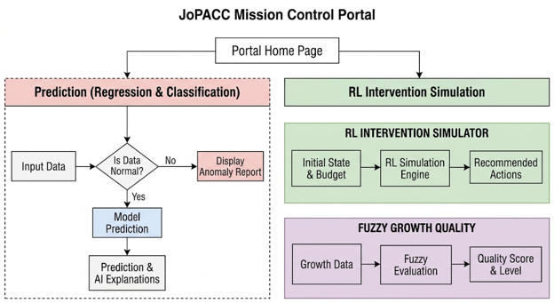

# JoPACC Mission Control Portal

An AI-powered decision-support portal developed using Jordanian payment-system data.  
The project combines supervised machine learning, explainable AI, anomaly detection, reinforcement learning, fuzzy logic, and a Flask web interface.

## Project Overview

The portal was designed to analyze and support decision-making for multiple Jordanian payment systems, including:

- JoMoPay
- CliQ
- eFAWATEERcom
- ACH
- ECCU

The system includes four main AI components.

## System Architecture

## 1. Supervised Prediction

### Regression
Predicts transaction value using operational and payment-system features.

Models compared:
- Linear Regression
- Random Forest Regression

Evaluation metrics:
- MAE
- RMSE
- R²

### Classification
Predicts payment-system activity level:

- Low Activity
- Normal Activity
- High Activity

Models compared:
- Random Forest Classifier
- Logistic Regression

Evaluation metrics:
- Accuracy
- Precision
- Recall
- F1-score
- Confusion Matrix

## 2. Explainable AI

Individual predictions are explained using:

- SHAP
- LIME
- Gemini-generated natural-language explanations

This allows users to understand which features increased or decreased each prediction.

## 3. Anomaly Detection

Unsupervised learning is used to identify unusual payment-system behavior.

Models:
- Isolation Forest
- One-Class SVM

The models were evaluated using ROC-AUC and anomaly-score analysis.

## 4. Reinforcement Learning

A Q-learning agent recommends operational interventions for different payment systems.

Example actions include:

- Run Awareness Campaign
- Improve System Monitoring
- Encourage Legal-Entity Participation
- Reduce Cash-Out Dependency

The agent learns policies that aim to improve system performance while considering intervention budgets.

## 5. Fuzzy Logic Growth Evaluation

A fuzzy decision-support system evaluates the growth quality of JoMoPay using:

- Transaction Growth
- User Growth
- Purchase Share
- Cash-Out Dependency

The system generates a Growth Quality Score and classifies growth as:

- Fragile
- Unbalanced
- Healthy
- Sustainable

## Web Application

The models are integrated into a Flask portal where users can:

- Enter payment-system data
- Generate predictions
- View SHAP and LIME explanations
- Detect anomalies
- Generate reinforcement-learning recommendations
- Evaluate JoMoPay growth quality

## Technologies

- Python
- Pandas
- NumPy
- Scikit-learn
- SHAP
- LIME
- Scikit-Fuzzy
- Reinforcement Learning
- Flask
- HTML
- Gemini API
- Jupyter Notebook

## Repository Structure

- `app.py` – Flask application
- `model.py` – supervised-learning inference
- `anomaly_model.py` – anomaly detection
- `rl_model.py` – reinforcement-learning component
- `fuzzy_jomopay.py` – fuzzy-logic evaluator
- `gemini_api.py` – natural-language XAI explanations
- `preprocessing.ipynb` – data preprocessing
- `Reg_Class.ipynb` – regression and classification
- `XAI.ipynb` – SHAP and LIME analysis
- `anomaly_detection.ipynb` – anomaly-detection experiments
- `RL.ipynb` – reinforcement-learning experiments
- `templates/` – Flask HTML pages
- `pkl_files/` – saved models and preprocessing objects
